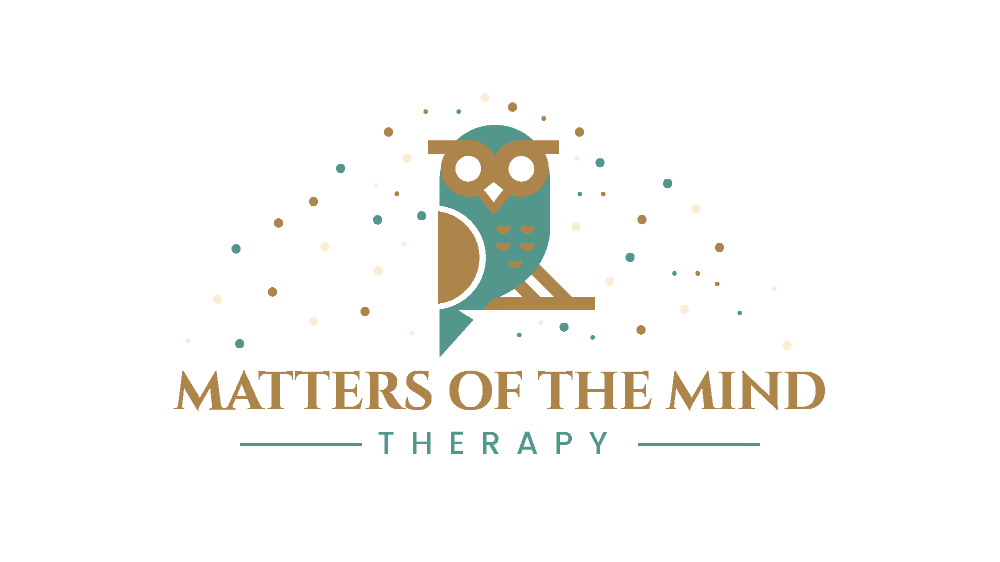

# Welcome

<figure markdown>
{ height="288" width="512" }
  <figcaption></figcaption>
</figure>

## Mission

Provide comprehensive behavioral health, education, and prevention services to patients interested in treatment using evidence-based psychotherapy techniques.

## Vision

### Professionalism First

Uphold moral and ethical principles in our daily practice and in delivery of services. Provide care in a manner that honors our professional codes and standards. Stay current on the latest known best practices and treatment options used in our sessions.

### Integrative Approach

Help patients learn what works for them, and what does not work for them, and then use a strengths-based approach to treatment.
Advocate for our patients and believe that every patient comes into therapy trying to do their best.
Provide collaborative treatment by connecting patients with complementary providers, for any patient that wants this type of support.
Identify with our patients’ situations and have a sense of their feelings and emotions related to their needs.

### Cultural Respect

Appreciate and respect the diversity and cultural differences of our patients and take into account the many multi-dimensional aspects of their lives. Recognize and help to preserve their culture by providing care that takes into consideration and supports, not replaces, their cultural identity.

## Affiliations

Being active members of the therapeutic community is important to us. Here are our current partnerships, memberships, and other affiliations. See our individual provider profiles for more details on our affiliations.

[{ height="64" width="256" style="display:block;margin-left:auto;margin-right:auto;" }](https://www.psychologytoday.com/us)
{ .card style="background:#477be4;" }

[{ height="64" width="128" style="display:block;margin-left:auto;margin-right:auto;" }](https://iocdf.org)
{ .card style="background:#ffffff;" }

[{ height="64" width="128" style="display:block;margin-left:auto;margin-right:auto;" }](https://helloalma.com)
{ .card style="background:#ffffff;" }

[{ height="64" width="256" style="display:block;margin-left:auto;margin-right:auto;" }](https://meetmonarch.com)
{ .card style="background:#ffffff;" }

