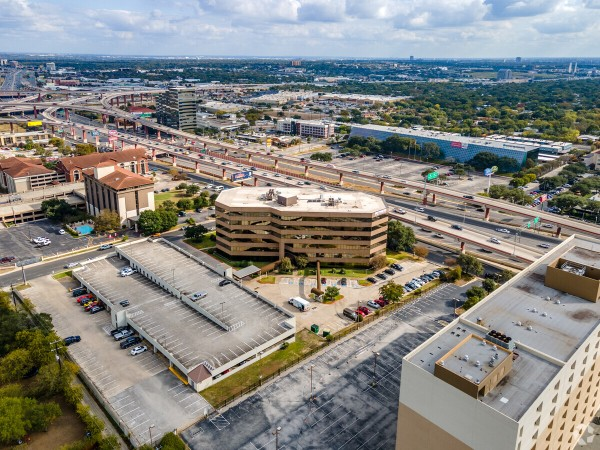
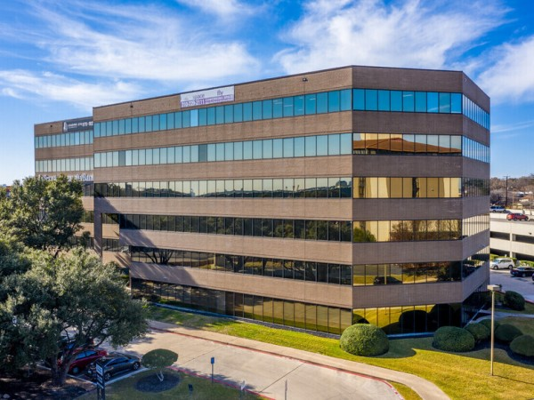
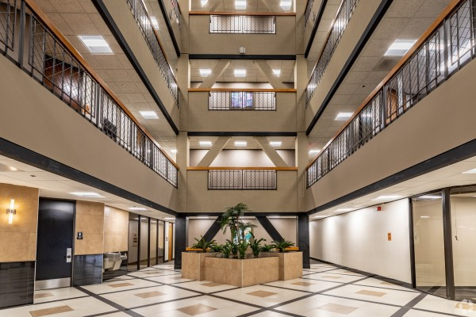
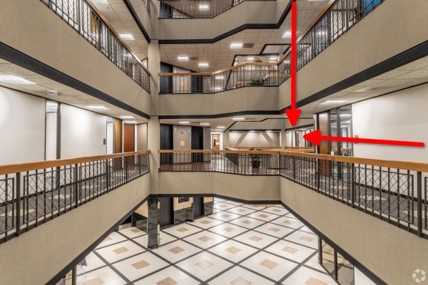

# Location

## Telehealth

All our providers are licensed by state boards to serve clients via telehealth or in-person psychotherapy sessions.
For telehealth services, clients must reside within a state that the therapist is licensed to provide services in.

## In Person

!!! warning "The San Antonio, TX Office is Moving!"

    _Friday, 20 December 2024_ will be the _final_ day that patients will have in-person appointments in the Farm Bureau Bank office (old office).

    _Wednesday, 1 January 2025_ will be the _first_ day that patients will have in-person appointments in the Atrium office (new office).

    Any sessions conducted after the last session in the old office, but before the first session in the new office will be telehealth.

### San Antonio, TX (Old)

!!! note

    **The _last_ session conducted at this office will be Friday, 20 December 2024.**

Matters of the Mind Therapy, PLLC  
17300 Henderson Pass, Suite 270  
San Antonio, TX 78232

In-person sessions in the North Central San Antonio area are conducted at our location on Henderson Pass.

This office is located on the second floor, in suite 270, of the Farm Bureau Bank building at the corner of Henderson Pass and Gold Canyon Rd. We share a waiting room with a co-located practice, [OnHealing Therapy](https://www.onhealingtherapy.com/).

  <iframe 
     title="Google Map, Farm Bureau Bank"
     src="https://www.google.com/maps/embed?pb=!1m18!1m12!1m3!1d10188.64336464941!2d-98.4611416636826!3d29.603303374315395!2m3!1f0!2f0!3f0!3m2!1i1024!2i768!4f13.1!3m3!1m2!1s0x865c8a225593e1a1%3A0xa8e7e45a627244eb!2s17300%20Henderson%20Pass%2C%20San%20Antonio%2C%20TX%2078232!5e1!3m2!1sen!2sus!4v1689196801600!5m2!1sen!2sus"
     style="border:3;"
     allowfullscreen=""
     loading="lazy"
     referrerpolicy="no-referrer-when-downgrade">
  </iframe>

### San Antonio, TX (New)

!!! note

    **The _first_ session conducted at this office will be Wednesday, 1 January 2025.**

Matters of the Mind Therapy, PLLC  
85 NE Interstate 410 Loop, Suite 203  
San Antonio, TX 78216

In-person sessions in the San Antonio Airport area are conducted at our location on the Northeast Interstate 410 Loop access road between the North Star Mall and the San Antonio International Airport.

This office is located in [the Atrium office building](assets/atrium-front.jpg) at the corner of the NE I-410 Loop access road and Mertz Drive.

The main entrance is in the [rear of the building](assets/atrium-rear.jpg), (not visible from the highway).

After entering [the lobby](assets/atrium-lobby.jpg), take an elevator to the second floor.

[Suite 203](assets/atrium-suite-203.jpg) will be to your left in the far hallway as you exit the elevator.

  <iframe
    title="Google Map, The Atrium"
    src="https://www.google.com/maps/embed?pb=!1m18!1m12!1m3!1d2762.2643836096895!2d-98.48685455404342!3d29.521322167498823!2m3!1f0!2f0!3f0!3m2!1i1024!2i768!4f13.1!3m3!1m2!1s0x865c6001075d2035%3A0x2ec6136e150155df!2sThe%20Atrium!5e1!3m2!1sen!2sus!4v1730821661868!5m2!1sen!2sus"
    style="border:3;"
    allowfullscreen=""
    loading="lazy"
    referrerpolicy="no-referrer-when-downgrade">
  </iframe>

<figure markdown>
  { height="450" width="600" }
  <figcaption>The Atrium Office Building (Rear View)</figcaption>
</figure>

<figure markdown>
  { height="450" width="600" }
  <figcaption>The Atrium Office Building (Front View)</figcaption>
</figure>

<figure markdown>
  { height="450" width="600" }
  <figcaption>The Atrium Office Building (Lobby View)</figcaption>
</figure>

<figure markdown>
  { height="450" width="600" }
  <figcaption>The Atrium Office Building (Suite 203 View)</figcaption>
</figure>

